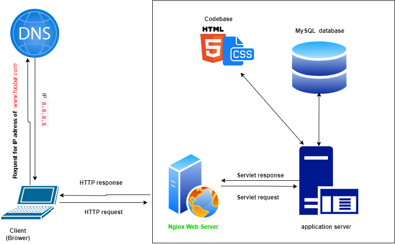

# Simple web stack

## server:
is a computer system or a software program that provides services or resources to other computers on a network in our case server has an IP address of 8.8.8.8
## Domain name role:
The domain name system (DNS) is responsible for translating domain names into IP addresses in our case domain name (foobar.com) it gets directed to the server with IP 8.8.8.8
## Type of DNS record www is in www.foobar.com:
The "www" is a subdomain
## The role of the web server:
is to handle incoming HTTP requests from users web browsers and respond with the requested web pages. in our case we use Nginx is a popular web server software
## The role of the application server:
hosts the website's application code base. It processes dynamic content and generates web pages to be served by the web server
## The role of the database:
stores and manages the website's data, such as user information, content, and other application-related data. in our case we use MySQL is a relational database management system (RDBMS) known for its reliability and scalability
## The server using to communicate with the computer of the user requesting the website
The web server (Nginx) receives this request, and if the content is static, it can directly serve it back to the user's browser
## Issues with this Infrastructure:
* SPOF:
all services are hosted on a single server, any failure or issue with that server can lead to a complete outage of the website
* Downtime during Maintenance:
When performing maintenance tasks, such as deploying new code or updating server configurations, the web server needs to be restarted. During this restart, the website may experience downtime, causing inconvenience to users
* nability to Scale for High Traffic:
With only one server, there are limitations on the amount of traffic the infrastructure can handle. As the website's popularity grows and traffic increases, a single server may not have enough resources to serve all the incoming requests effectively.
